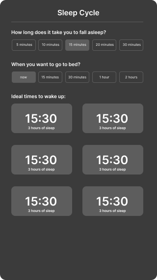

# Use / Uso

### Online via Expo Snack:
Click on the icon bellow and then on "Launch Snack".

Clique no ícone abaixo e então em "Launch Snack".

### Local:

Instale o arquivo .apk da aba releases.

Install the .apk file from the releases tab.

# Descrição

### Descrição Técnica do Projeto: Aplicativo Sleep Cycle

**Objetivo:** Desenvolver um aplicativo front-end em React Native para calcular e sugerir horários de despertar baseados em ciclos de sono, melhorando a qualidade do sono do usuário.

**Contexto dos Ciclos de Sono:** Os ciclos de sono duram aproximadamente 90 minutos, e acordar no final de um ciclo resulta em um despertar mais revigorante. Acordar no meio de um ciclo pode levar a um despertar mais cansativo.

**Funcionalidades:**

- **Header:** Nome do app "Sleep Cycle" centralizado no topo da tela.

- **Configuração de Tempo para Dormir:** Pergunta: "Quanto tempo você costuma demorar para dormir?" Opções: "5 minutos", "10 minutos", "15 minutos", "20 minutos", "30 minutos". Seleção padrão: "15 minutos". Permite ao usuário selecionar uma opção.

- **Hora de Ir para a Cama:** Pergunta: "Quando você pretende ir pra cama?" Opções: "Agora", "15 minutos", "30 minutos", "1 hora", "2 horas". Seleção padrão: "Agora". Permite ao usuário selecionar uma opção.

- **Cálculo e Exibição dos Ciclos de Sono:** Calcula horários ideais de despertar baseados em ciclos de sono de 90 minutos a partir do horário definido para dormir. Exibe 6 horários finais de ciclo (despertar) e a duração total do sono até cada horário de despertar.

**Requisitos:** Expo e todas as suas dependências.

**Uso:** Clone o repositório localmente em sua máquina, abra o terminal e digite "npm start".

**Criado com:** React Native + Expo + TypeScript.

# Description

### Technical Description of the Project: Sleep Cycle App

**Objective:** Develop a front-end application in React Native to calculate and suggest wake-up times based on sleep cycles, improving the user's sleep quality.

**Context of Sleep Cycles:** Sleep cycles last approximately 90 minutes, and waking up at the end of a cycle results in a more refreshing awakening. Waking up in the middle of a cycle can lead to feeling more tired.

**Features:**

- **Header:** The app name "Sleep Cycle" centered at the top of the screen.

- **Sleep Time Configuration:** Question: "How long do you usually take to fall asleep?" Options: "5 minutes", "10 minutes", "15 minutes", "20 minutes", "30 minutes". Default selection: "15 minutes". Allows the user to select an option.

- **Bedtime Selection:** Question: "When do you plan to go to bed?" Options: "Now", "15 minutes", "30 minutes", "1 hour", "2 hours". Default selection: "Now". Allows the user to select an option.

- **Calculation and Display of Sleep Cycles:** Calculates ideal wake-up times based on 90-minute sleep cycles from the defined bedtime. Displays 6 final cycle (wake-up) times and the total sleep duration until each wake-up time.

**Requirements:** Expo and all its dependencies.

**Usage:** Clone the repository locally on your machine, open the terminal, and type "npm start".

**Created with:** React Native + Expo + TypeScript.

# Inspiration / Inspiração:

[**Figma**](https://www.figma.com/design/AnwZh6cquji9MtaYOEsrXK/Sleep-Cycle?node-id=0-1&t=MtbYK51AMwqA2D1Y-1)

